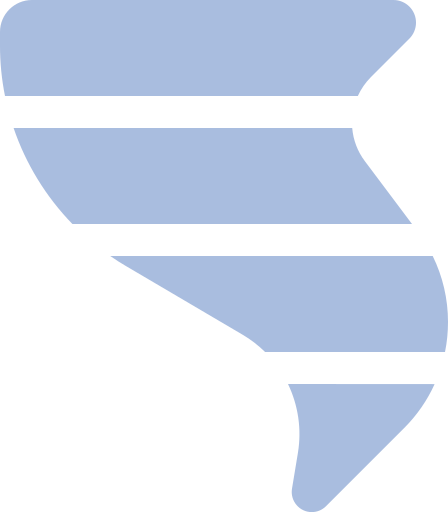

# 🌪️ Prevent - Natural Disaster Monitoring System



Prevent is a React-based web application designed to assist in monitoring and preventing natural disasters by providing real-time information about risk areas, weather conditions, and event history.

## 🚀 Features

- 🗺️ Interactive map with risk areas
- 📊 Precipitation and weather condition charts
- 🔍 Real-time natural disaster monitoring
- 📱 Responsive and intuitive interface
- 📈 Event history and alerts

## 🛠️ Tech Stack

- **Frontend**:
  - React 19
  - React Router DOM
  - Styled Components
  - Bootstrap 5
  - Font Awesome
  - Leaflet (interactive maps)
  - Recharts (data visualization)

- **Development Tools**:
  - Vite
  - ESLint + Prettier
  - Git + Husky

## 🚀 Getting Started

### Prerequisites

- Node.js (v16 or higher)
- npm or yarn
- Git (optional)

### Installation

1. Clone the repository:
   ```bash
   git clone [REPOSITORY_URL]
   cd Challenge2
   ```

2. Install dependencies:
   ```bash
   npm install
   ```

3. Start the development server:
   ```bash
   npm run dev
   ```

4. Open your browser and visit:
   ```
   http://localhost:5173
   ```

## 🏗️ Project Structure

```
src/
├── components/      # Reusable components
├── pages/           # Application pages
├── App.jsx          # Root component
├── main.jsx         # Entry point
└── routes.jsx       # Routing configuration
```

## 🌐 Available Routes

- `/` - Home page
- `/results` - Monitoring and results
- `/projects` - Related projects
- `/configurations` - System settings
- `/historico` - Event history

## 🛠️ Development

- Lint code:
  ```bash
  npm run lint
  ```

- Format code:
  ```bash
  npm run format
  ```

- Build for production:
  ```bash
  npm run build
  ```

## 🤝 Contributing

Contributions are welcome! Please feel free to submit a Pull Request.

## 📝 License

This project is licensed under the MIT License - see the [LICENSE](LICENSE) file for details.

## 📞 Contact

For more information, please contact: [caiqueazevedo2005@gmail.com](mailto:caiqueazevedo2005@gmail.com)

---

Built with ❤️ by Caique Azevedo
